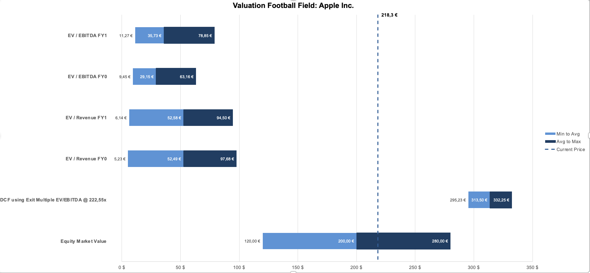
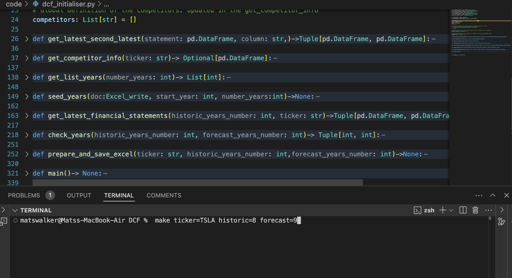
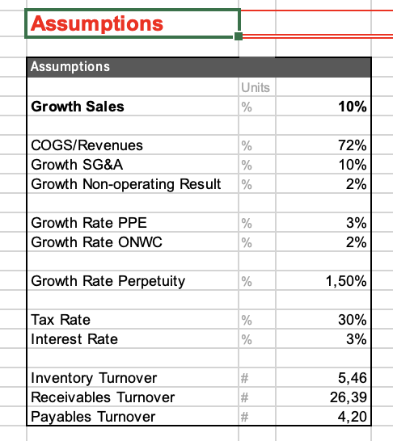

# **DCF_Engine**

## Overview
This file helps to create DCFs for listed companies of the S&P500 index. The DCF will be returned in an Excel file that can be further modified according to the user's estimations. The DCF lets you choose from different valuation methods at the end of the forecasted period. This includes constant perpetual growth, EV/EBITDA and EV/Revenue exit multiples.

The model additionally includes other valuation methods such as comparable multiples and historic market valuations.

[**Click here to open an example DCF for Apple**](./resources/DCF_template.xltm)

Note that the Excel file is mainly controlled through the "Assumptions" sheet. Further changes can be made to the other sheets, but these may need to be unlocked or unhidden.

## Usage
For usage, run **make** in the command line. **Ticker**, **number of historic years** and **years to forecast** can be inputed as global variables in the command line using:

Else, the program will ask for them. Note that the number historic years is constrained to 3-10 years and the forecasted years are constrained to up to 10 years.
Only companies from the US can be used for the DCF. However, other companies can be used as comparables for multiples.

To adjust the DCF, use the **Assumptions** and **PPE & Depreciation** page. By default, these are filled with the averages of the historic years.

Further, more fine grained adjustments can be done in the DCF page, but this is generally not encouraged and may lead to unexpected behavior.

The main **Competitors** of the company will be tried to fill programatically. If this fails, they will need to be inputed in the [dcf_initialiser](/DCF_Engine/dcf_initialiser.py) by hand.

## Assumptions
The DCF is build on the following assumptions:
- **Growth of sales**:  Average throughout the historic period
- **Risk-free rate**:   10 year US treasury bills
- **Market return**:    Average return of S&P500 throughout the historic period
- **Beta Equity**:      Calculated based on correlation with S&P500
- **Financial Ratios**: Average of the last years
- **Multiples**:        Average of competitors

## Problems & Work-to-be-done
While the code works, the Excel usually has problems. It raises a warning when opening and does not include the full Football field chart with all its info. Manual adjustments are thus needed. This problem is likely due to the libraries used and not the code itself. This may be changed in the future.
 
In addition, the competitors may need to be manually inputed and can not always be generated automatically. While the [fmpsdk](DCF_Engine/fmpsdk_query/fmpsdk_query.py) code has a method to query competitors, it does not work reliably and should not be used without manual double-checking.

In the future, a database of the info will be established such that the financial data for companies does not need to be queried every time again.

## Dependencies
To query necessary infomation from multiple APIs, the code has many dependencies. These include the following unusual ones:  
- **wrds** (Wharton Financial Data for Research Projects) (Requires a valid account)  
- **yfinance**   
- **fmpsdk** (Requires valid, but free account)
- **pycel** and **openpyxl** (two libraries used for the interaction with excel)
- **DCF_Engine** Self-written library to facilitate work with Excel
